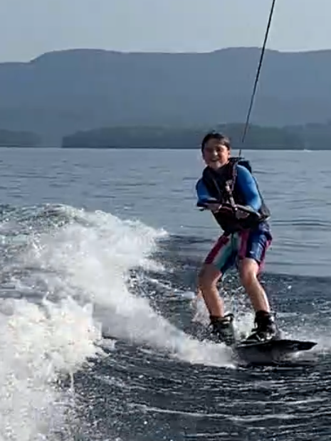
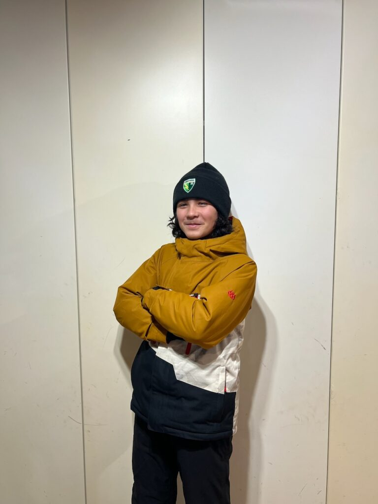

# Our Team - HapLink

---

## Meet Our Team

> "Our goal as a team is to try to make sure that everyone is doing something, and something they want to be doing."

Our team, **The Happy Haptic Doctors**, is made up of seven middle schoolers assisted by two coaches. All of us live along the borders of New Hampshire and Vermont, yet go to the same school. Most of our members did FLL in 2022, so we decided to do it again. As we started to talk about our Innovation Project, we focused on our shared interests of Music and Sports.

---

## Team Members

### Kastner Anderson

Kastner

---

### Charlie Devlin

Charlie enjoys a wide range of sports including wakeboarding, tae kwon do, mountain biking, lacrosse, soccer, and skiing. He also loves logic puzzles and solving the Rubik's cube.

---

### Grayson Lyall

Grayson enjoys watching and playing soccer, skiing, and playing piano and trumpet.

---

### Owen Osterberg

Owen ski races, likes to mountain bike, plays tennis, and surfs occasionally. He also plays the violin.

---

### B Swenson

B likes drawing digitally and traditionally, and many different sports. He's planning on learning how to animate over the summer.

---

### Andy Zhang

Andy enjoys many activities, such as hockey, soccer, and playing the saxophone. He also enjoys Math competitions and chess.

---

### Ella Zhang

Ella enjoys playing several different sports such as hockey, soccer, basketball, and tennis. She also plays the flute. In her spare time, she likes to create art, bike, and play chess.

---

## Coaches

### Erich Osterberg

Erich is an Associate Professor of Earth Sciences at Dartmouth.

---

### Yu Zhang

Yu is a Plasma Process Engineer at Hypertherm.

---

## A Day in the Life of a Haptic Doctor

We work on a variety of tasks:
- Deciding on our game plan
- Building the robot and attachments
- Coding
- Testing each mission

---

## Different Jobs You Can Do

- Brainstorming
- Building with Legos
- Coding
- Testing Missions
- Soldering
- Prototyping our Haptic products
- Website design!

---

**HapLink**

Copyright © 2023